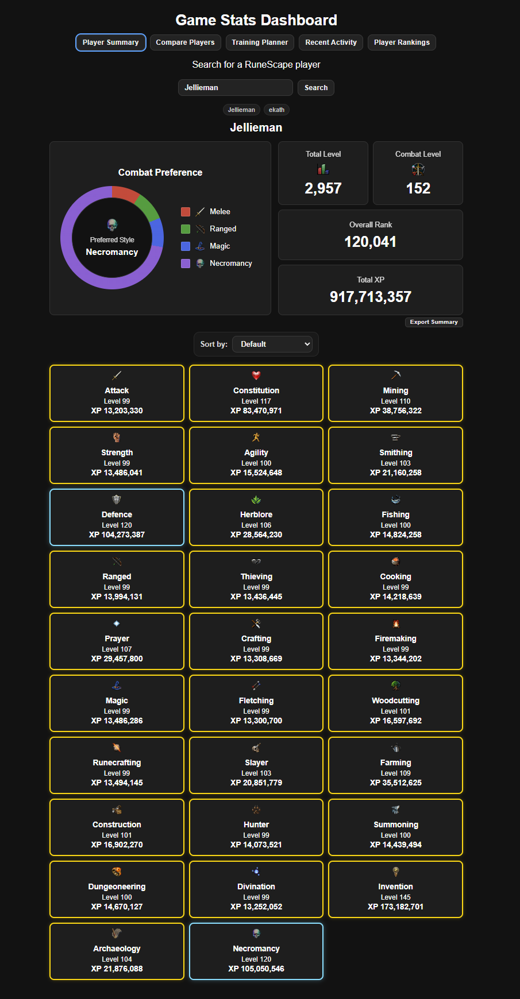
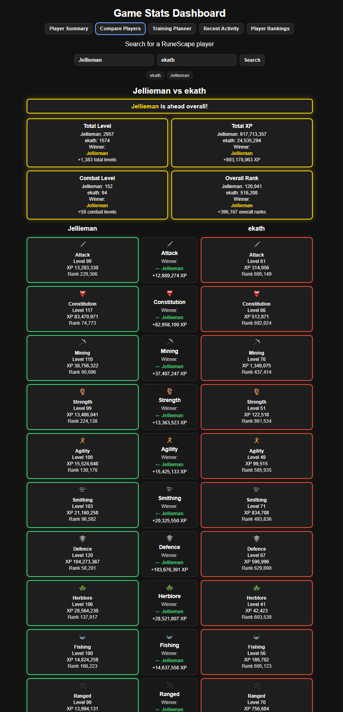
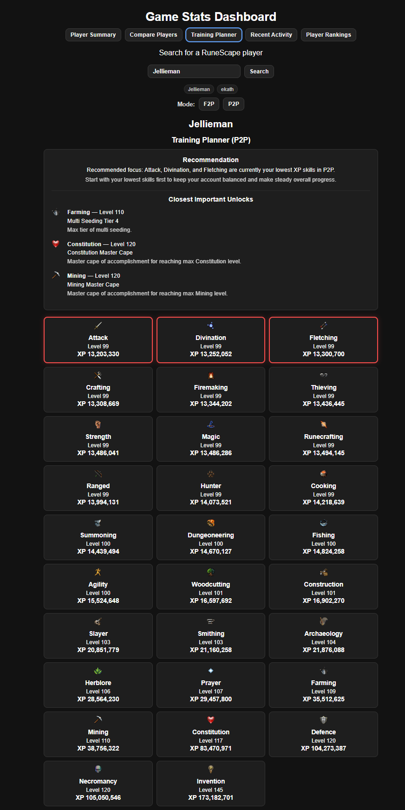
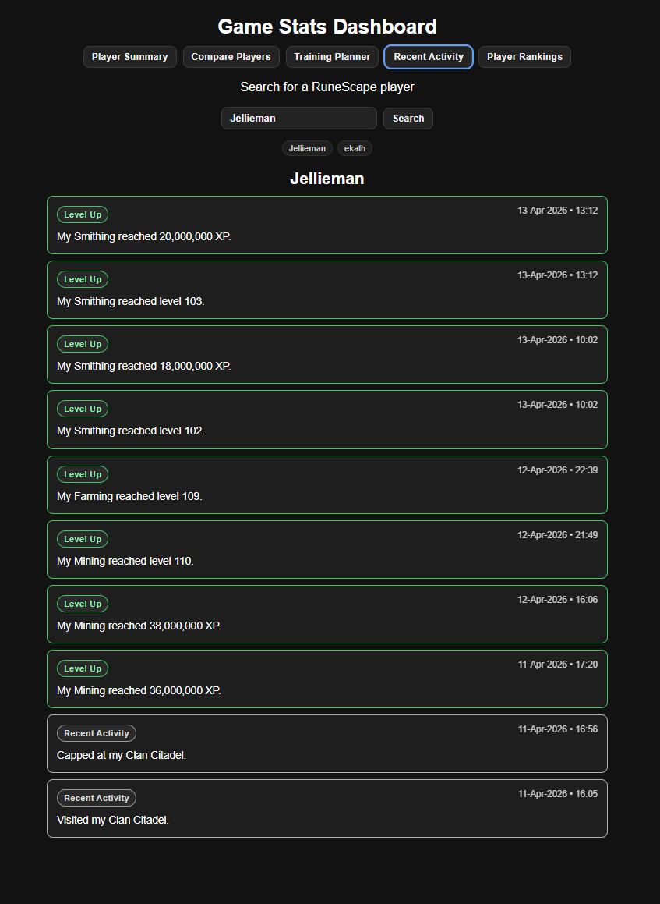
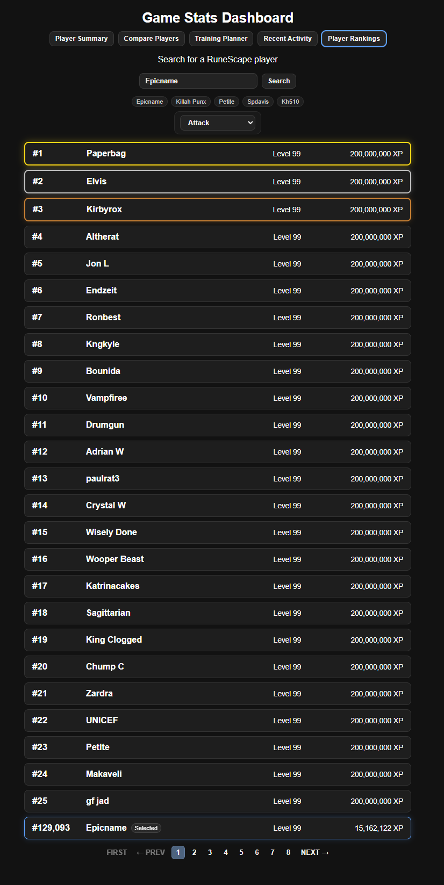

# RS3 Player Tool

A RuneScape 3 player dashboard built with JavaScript and Express.

This app allows users to search for RuneScape 3 players and view useful account information including skill stats, activity, quests, comparisons, training planning, and rankings.

---

## Live Version

The app is hosted online:

https://rs3-player-tool.vercel.app

No installation required.

---

## Features
- Use these usernames for testing: Jellieman, Ekath, Zezima, Epicname

### Player Summary
- Search for any RuneScape 3 player
- View total level, XP, and individual skill levels
- Sort skills by:
  - level
  - XP
  - rank
  - default game order

### Compare Players
- Compare two players side by side
- Compare:
  - total level
  - total XP
  - combat level
  - overall rank

### Training Planner
- View skill milestone unlocks
- Identify useful progression targets
- Helps plan leveling strategy

### Recent Activity
- Pulls data from the RuneScape Adventurer's Log
- Displays recent in-game activity

### Quests
- Displays quest-related player information

### Player Rankings
- Displays RuneScape hiscore ranking pages

Note:
The Rankings feature may be unavailable in the hosted version because the RuneScape rankings endpoint can block server-hosted requests (HTTP 403).

All other features work normally.

Rankings may still work when running the app locally.

---

## Tech Stack

- HTML
- CSS
- JavaScript
- Node.js
- Express

---

## Project Structure
```
.
├── public/
│ ├── index.html
│ ├── style.css
│ ├── script.js
│ ├── milestones.js
│ └── icons/
├── server.js
├── package.json
├── package-lock.json
└── README.md
```
---

## Running the App Locally

Running locally allows full functionality and may allow Rankings to work depending on upstream access.

### 1. Install Node.js

Download Node.js:

https://nodejs.org/

Recommended version:
- Node 18 or newer

Verify installation:

node -v

---

### 2. Download the project

Option A — Download ZIP
1. Click the green **Code** button on GitHub
2. Click **Download ZIP**
3. Extract the folder

Option B — Clone repository

git clone https://github.com/YOUR-USERNAME/rs3-player-tool.git
cd rs3-player-tool

---

### 3. Install dependencies

npm install

---

### 4. Start the server

npm start

---

### 5. Open the app

Open your browser and go to:
http://localhost:3000

---

## Hosted Version vs Local Version

| Feature | Hosted | Local |
|--------|--------|-------|
| Player search | yes | yes |
| Compare players | yes | yes |
| Training planner | yes | yes |
| Activity lookup | yes | yes |
| Quest lookup | yes | yes |
| Rankings | unavailable | may work |

Reason:
The RuneScape rankings endpoint sometimes blocks hosted server requests.

---

## Known Issue

### Rankings endpoint returning 403

The RuneScape rankings page may block server-hosted requests.

When this happens, the Rankings tab will display:

"Rankings currently unavailable"

All other app features continue to work normally.

---

## Future Improvements

Possible improvements:

- improve rankings reliability
- improve mobile layout
- add XP progression charts
- add PvM progression tracking
- improve UI polish

---

## Screenshots

### Player Summary


### Compare Players


### Training Planner


### Recent Activity


### Rankings


---

## Author

Ruan F Jacobs